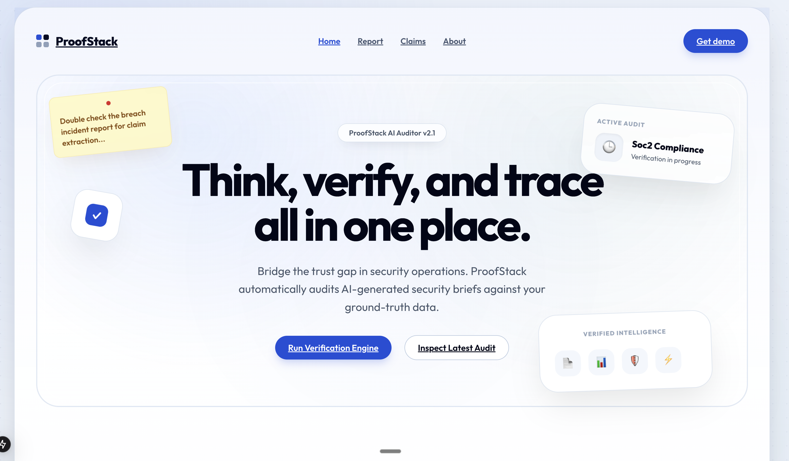
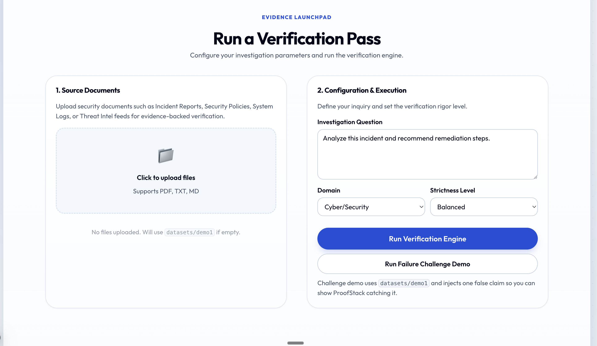
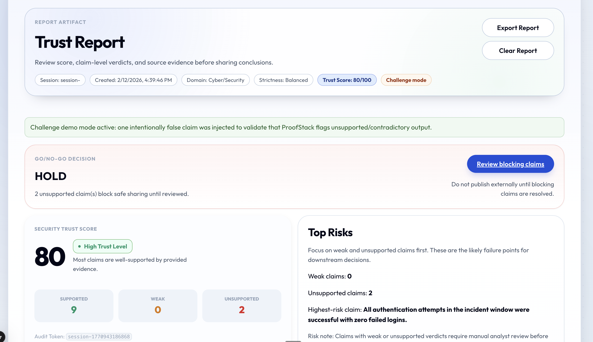
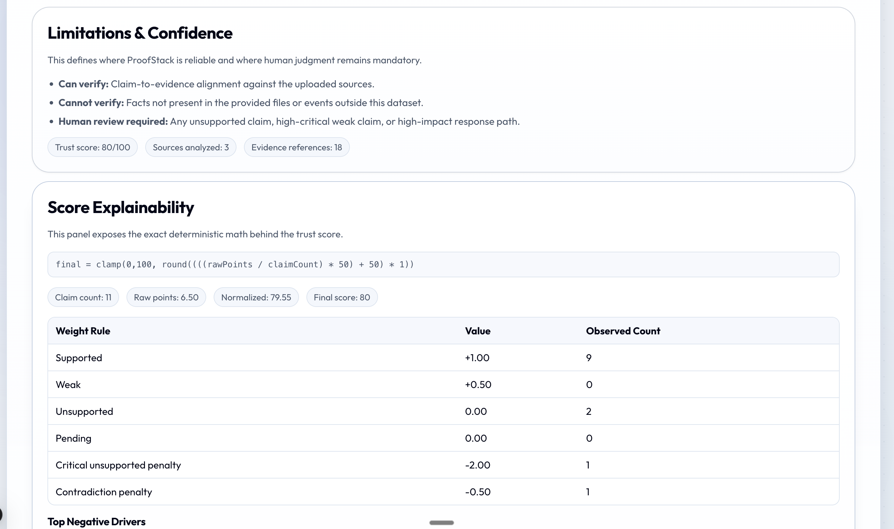
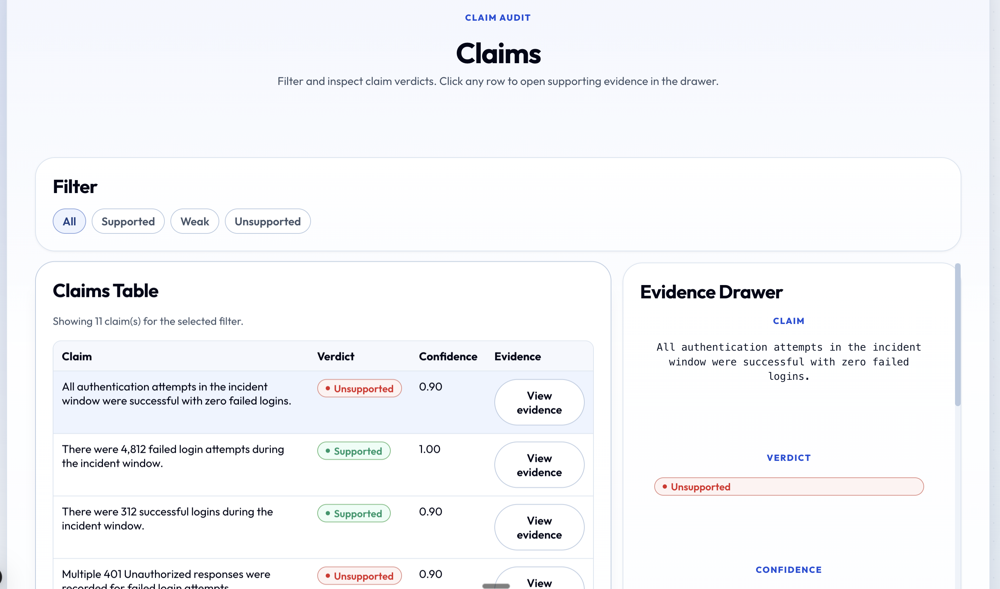
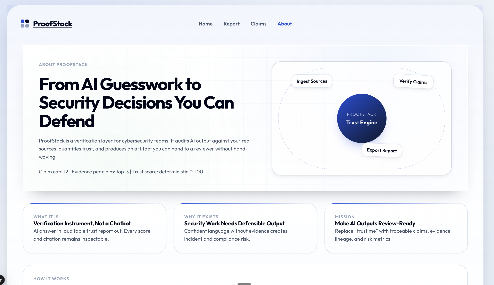

# ProofStack

ProofStack helps teams verify AI-generated answers before those answers are used for real decisions.

In simple terms:

- AI gives an answer.
- ProofStack breaks that answer into small claims.
- Each claim is checked against your source files.
- You get a report that shows what is supported, weak, or unsupported.

This makes AI output easier to trust, review, and share.

## Why this project exists

AI answers are often useful, but they can also be confidently wrong.

That is risky in any serious workflow, not just cybersecurity. Teams need a way to see:

- what the model claimed
- what evidence supports each claim
- where the answer is weak or unsupported

ProofStack is built to provide that visibility.

## Who this helps

- Analysts who use AI for incident or risk summaries
- Reviewers who need proof before approving output
- Teams that want a repeatable verification workflow instead of one-shot AI responses

## What ProofStack does

1. Accepts uploaded files (`.pdf`, `.txt`, `.md`) or a demo dataset
2. Generates a draft answer for a user question
3. Extracts verifiable claims from the draft
4. Retrieves relevant evidence snippets for each claim
5. Assigns verdicts (`supported`, `weak`, `unsupported`)
6. Computes trust score and impact metrics
7. Produces a verified answer with evidence references
8. Exports a markdown report

## Product Screens

### 1) Home

Landing section and main call to action.



### 2) Run Verification Pass

Source upload, question input, strictness controls, and challenge demo mode.



### 3) Trust Report (Top Section)

Session metadata, decision state, trust score summary, and top-risk context.



### 4) Trust Report (Details)

Quantified impact, limitations and confidence, score explainability, and draft-vs-verified output.



### 5) Claims and Evidence

Claim-level verdict table with side evidence drawer for drilldown.



### 6) About

High-level explanation of purpose, value, and flow.



## Core Features

- Claim-level verification pipeline
- Evidence lineage from answer citations to source snippets
- Deterministic trust score with explainability
- Go/No-Go decision banner (`HOLD` or `SAFE TO SHARE`)
- Quantified impact metrics
- Limitations and confidence panel
- Draft vs Verified comparison
- Markdown export for review handoff

## Architecture Overview

Main verification flow is implemented in `POST /api/verify`.

Pipeline stages:

1. source loading
2. chunking
3. draft answer generation
4. claim extraction
5. evidence retrieval
6. claim verification
7. trust scoring
8. redlined verified answer
9. session persistence

Key modules:

- `src/lib/pipeline/chunkSources.ts`
- `src/lib/pipeline/draftAnswer.ts`
- `src/lib/pipeline/extractClaims.ts`
- `src/lib/pipeline/retrieveEvidence.ts`
- `src/lib/pipeline/verifyClaims.ts`
- `src/lib/pipeline/scoreReport.ts`
- `src/lib/pipeline/redlineAnswer.ts`

## Tech Stack

- Next.js 15 (App Router)
- React 19
- TypeScript
- Next.js API routes
- Custom CSS design system

LLM integration:

- OpenAI Chat Completions via `src/lib/llm/openaiChat.ts`
- If OpenAI is not configured, fallback logic keeps the app runnable for demos

## API Endpoints

- `GET /api/health`  
  returns service health
- `POST /api/verify`  
  runs full verification pipeline
- `GET /api/verify/latest`  
  returns latest session
- `DELETE /api/verify/latest`  
  clears latest session
- `POST /api/export`  
  exports markdown report

## Repository Structure

```text
src/
  app/
    page.tsx                 # Home
    report/page.tsx          # Trust report
    claims/page.tsx          # Claim review
    about/page.tsx           # Product overview
    api/
      verify/route.ts        # Verification pipeline
      verify/latest/route.ts # Session retrieval/clear
      export/route.ts        # Markdown export
      health/route.ts        # Health endpoint
  components/
    navigation/
    report/
  lib/
    pipeline/
    report/
    session/
    types/
datasets/
  demo1/
public/
  images/
```

## Local Development

Prerequisites:

- Node.js 18+
- npm

Run locally:

```bash
npm install
npm run dev
```

Open `http://localhost:3000`.

Validation:

```bash
npm run typecheck
npm run build
```

## Environment Variables

Create `.env.local` for live model calls:

```bash
OPENAI_API_KEY=your_key
OPENAI_MODEL=gpt-4.1-mini
```

Without `OPENAI_API_KEY`, the app still runs using fallback behavior.

## Quick Demo Flow

1. Open Home
2. Upload files or run demo mode
3. Click `Run Verification Engine`
4. Open `Report` and review:
   - decision banner
   - verdict breakdown
   - evidence references
5. Export report

## Current Limits

- Domain currently focused on Cyber/Security
- Verification quality depends on source coverage
- Persistence is local and file-based in current version
- External fact checking outside uploaded sources is out of scope

## Next Steps

- PDF export format
- Persistent multi-session history
- Additional domain presets
- CI integration for automated checks
